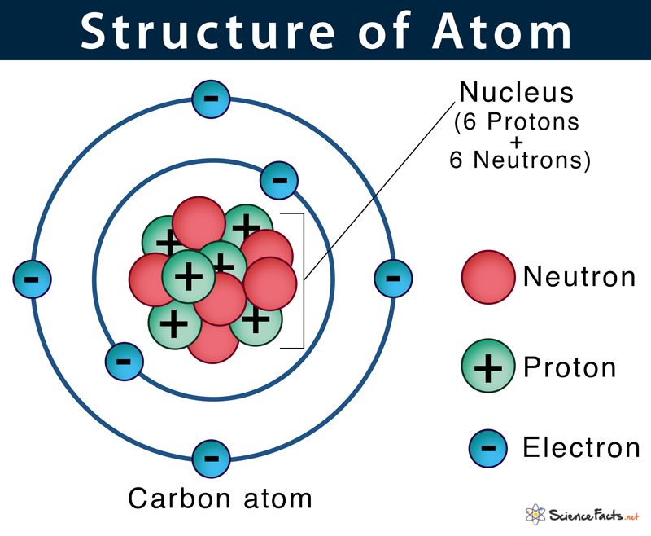

> [!WARNING]
> 학습 내용으로 틀린 내용이 있을 수 있습니다. \
> 잘못된 내용이 있을 경우 알려주시면 감사하겠습니다.

## 원자의 구조와 내부 구성 요소

원자는 물질을 구성하는 가장 작은 단위이며, 다양한 입자로 이루어져 있다. 아래 그림은 원자의 구조를 시각적으로 나타낸 것이다.

| | |
| --- | --- |
|  |  |

### 🧪 원자의 내부 구성 요소  

원자는 **핵(nucleus)** 과 **전자 구름(electron cloud)** 으로 나뉜다.  
핵 안에는 **양성자(proton)** 와 **중성자(neutron)** 가 있으며, **전자(electron)** 는 핵 주위를 회전하며 원자의 전체적인 구조를 형성한다.

#### 원자핵 (Nucleus)  
- **양성자 (Proton, +)** : 양의 전하를 띠며, 원자의 원소 번호를 결정한다.  
- **중성자 (Neutron, 0)** : 전하를 띠지 않으며, 원자의 질량을 증가시키는 역할을 한다.

#### 전자 구름 (Electron Cloud)  
- **전자 (Electron, -)** : 음의 전하를 띠며, 원자핵 주위를 회전한다.  
- 전자는 특정한 **에너지 준위(orbitals)** 를 따라 배치되며, 화학적 성질을 결정하는 중요한 요소이다.

### 🔬 원자의 성질  
원자는 기본적으로 전기적으로 중성이지만, 전자를 잃거나 얻으면 **이온(ion)** 이 되어 전하를 가지게 된다.  
또한, 동위원소(isotope) 개념을 통해 같은 원소라도 중성자 수에 따라 다양한 형태가 존재할 수 있다.

---

이처럼 원자는 작은 크기 속에서도 복잡한 구조와 성질을 지니고 있으며, 다양한 화학 반응에서 중요한 역할을 한다.

## 전하와 전하량  

물리학에서 **전하(charge)** 는 물질이 가지는 기본적인 성질 중 하나이며, 전기력의 원천이 된다. 전하는 양전하(+)와 음전하(-)로 구분되며, 같은 전하는 서로 밀어내고, 반대 전하는 서로 끌어당긴다.

> [!NOTE]
> 전하 보존 법칙 (Law of Conservation of Charge) 
전하는 생성되거나 소멸되지 않고, **총량이 항상 일정하게 보존**된다. 

---

### 📏 전하량 (Charge Quantity)  

전하량은 전하의 크기를 나타내는 물리량이며, 보통 **\( q \)** 로 표기된다.  
전하량의 기본 단위는 **쿨롱(Coulomb, C)** 이며, 기본 전하(e)는 다음과 같이 정의된다.

$$ e = 1.602 \times 10^{-19} C $$

#### 🔹 전하량 표기 방식  
- **\( q \)** : 일반적인 전하량 표현 (단위: 쿨롱, \( C \))  
- **\( e \)** : 기본 전하 (전자의 전하량, \( 1.602 \times 10^{-19} C \))  
- **\( Q \)** : 총 전하량(거시적 시스템에서의 전하량)

## 전기 발생

> [!NOTE]
> 전기는 전하의 이동과 상호작용에 의해 발생합니다. 물체가 전기를 가지게 되는 과정은 전기적 중성, 대전, 대전체 등의 개념과 밀접하게 관련이 있습니다.

출처 [https://www.reddit.com/](https://www.reddit.com/r/mildlyinteresting/comments/6m5hux/my_cat_that_is_not_amused_that_i_stuck_balloons/?rdt=35674)

| 명칭 | 특징 | 설명 |
| --- | --- | --- |
| 전기적 중성 | 전기적 중성 | 물체 내의 양전하(양성자)와 음전하(전자)의 수가 같다 |
| 대전 | 전기를 가지게 되는 현상 | 서로 접촉하거나 마찰을 통해  물체의 전자가 이동함으로써 발생한다. |
| 대전체 | 대전된 물체의 전하를 측정 |  일반적인 대전체는 금속 바늘이나 금속 판이 연결된 장치로, 대전된 물체가 대전체와 접촉하거나 가까워지면 전하가 전달되어 바늘이 움직이게 된다 |

## 도체 부도체

| 명칭 | 설명 | 종류 |
| --- | --- | --- |
| 도체 | 전류를 잘 흐르게 하는 물질 | 구리, 알루미늄, 금, 은 |
| 부도체 | 전류가 잘 흐르지 않는 물질 | 고무, 나무, 유리, 플라스틱 |
| 반도체 | 도체와 부도체의 중간적 성질을 가지는 물질 | 실리콘, 게르마늄, 갈륨 아르세나이드 |

