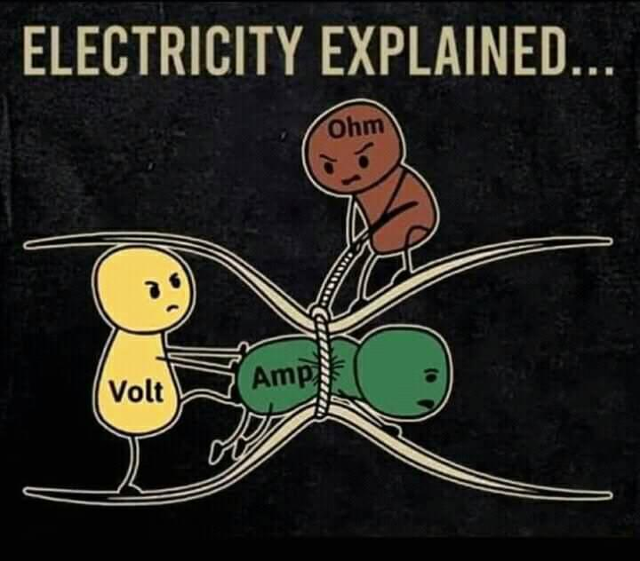
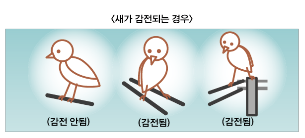

> [!WARNING]
> 학습 내용으로 틀린 내용이 있을 수 있습니다. \
> 잘못된 내용이 있을 경우 알려주시면 감사하겠습니다.

# 전압, 전류, 저항: 전기 회로의 핵심 원리


출처 : [https://www.wattblock.com/](https://www.wattblock.com/ev-readiness-for-strata---the-basics.html)
> [!NOTE]
> 전기는 현대 사회에서 빼놓을 수 없는 중요한 에너지원입니다. 전기를 이해하려면 기본적인 전기 용어인 **전압**, **전류**, **저항**에 대한 이해가 필요합니다. 이번 글에서는 이 세 가지 개념을 간단히 설명하고, 서로 어떻게 연결되는지 알아보겠습니다.

## 1. 전압 (Voltage)

**전압**은 전기 회로에서 전하를 이동시키는 "힘"입니다. 쉽게 말해, 전압은 전기 에너지를 전하에 제공하여 전자가 흐를 수 있도록 하는 원동력입니다. 전압은 일반적으로 **V**로 표시되며, 단위는 **볼트 (V)**입니다.

전압은 두 지점 간의 전위차로 정의됩니다. 즉, 한 지점에서 다른 지점으로 전하가 이동하려면 두 지점 사이에 전위차가 존재해야 합니다. 이 전위차가 바로 전압입니다.

### 전압의 예시
- **배터리**는 양극과 음극 사이에 전압을 제공하여 전자를 흐르게 합니다.
- **전기 콘센트**에서 나오는 전압은 전자 제품이 작동할 수 있도록 에너지를 제공합니다.

### 전압 계산 공식

전압은 다른 방식으로도 정의할 수 있습니다. **전압 = 일 / 전하**로 나타낼 수 있습니다. 즉, 전압은 **전하**(q)에 의해 **일**(w)이 수행되는 비율입니다. 이를 수학적으로 나타내면:

```math
V = \frac{W[J]}{Q[C]}
```

> [!IMPORTANT]
> 유기기전력 (Electromotive Force : EMF)
> EMF는 전기 회로 내에서 전류를 흐르게 만드는 "원동력"입니다. 쉽게 말해, 전압의 한 형태로 생각할 수 있습니다.\
> 단위: E\
> 공식: 
>> $$ E = V = \frac{W[J]}{Q[C]} $$
## 2. 전류 (Current)

**전류**는 전하가 회로를 따라 흐르는 흐름을 말합니다. 전류는 전압에 의해 발생하며, 전류의 세기는 전압에 비례하고 저항에 반비례합니다. 전류는 일반적으로 **I**로 표시되며, 단위는 **암페어 (A)**입니다.

전류는 전자들이 한 방향으로 이동하는 흐름이기 때문에 **전자 흐름**이라고도 불립니다. 전류는 주로 전기 회로에서 전력을 전달하는 역할을 합니다.

- **단위**: 암페어 (A, Ampere)
- **공식**: 전류는 **전하**의 흐름을 나타내므로, 다음과 같은 공식으로 나타낼 수 있습니다:

$$ I = \frac{Q}{t} $$

- **I**: 전류 (암페어, Ampere)
- **Q**: 전하 (쿨롱, Coulomb)
- **t**: 시간 (초, Seconds)

### 전류의 예시
- 전기 제품이 켜질 때, 전류가 회로를 따라 흐르며 제품에 전력을 공급합니다.
- **전구**에서 불빛이 나오는 것도 전류가 전구 안의 필라멘트를 통과하면서 발생하는 현상입니다.

> [!IMPORTANT]
> 전력은 전기 회로에서 **단위 시간당 소비되는 에너지**를 나타냅니다. 즉, 전력은 전압과 전류가 결합하여 얼마나 많은 에너지가 흐르는지를 보여줍니다.\
> **단위**: 와트 (W, Watt)
> **공식**: 전력은 전압과 전류의 곱으로 계산됩니다:\
>> $$ P = V \times I $$

## 3. 저항 (Resistance)



**저항**은 전류의 흐름을 방해하는 물질의 성질을 말합니다. 회로 내에서 전류가 흐를 때, 전자들이 원자들과 충돌하면서 에너지를 소모하게 되는데, 이때 발생하는 저항이 바로 **저항**입니다. 저항은 일반적으로 **R**로 표시되며, 단위는 **옴 (Ω)**입니다.

저항이 클수록 전류의 흐름은 더 어려워집니다. 이 때문에 전선의 재질이나 길이, 두께가 회로에서 저항에 영향을 미칩니다.

$$ 
R = \rho \frac{L}{A}
$$

- R: 저항 (옴, Ω)
- ρ (rho): 물체의 고유 저항률 (옴·미터, Ω·m)
- L: 도체의 길이 (미터, m)
- A or S: 도체의 단면적 (제곱미터, m²)


### 저항의 예시
- **철선**은 전류가 흐르는 데 더 많은 저항을 제공합니다. 반면, **구리선**은 저항이 적어 전류가 더 쉽게 흐를 수 있습니다.
- **전기 히터**는 저항이 높은 재료를 사용하여 전류를 열 에너지로 변환하는 데 사용됩니다.

#### 저항률 (ρ (rho), Resistivity)
정의: 저항률은 물질의 고유한 특성으로, 물질이 전류의 흐름을 얼마나 저항하는지를 나타냅니다. 즉, 저항률이 높을수록 물질은 전류의 흐름에 더 큰 저항을 제공합니다.
단위: 옴·미터 (Ω·m)
공식: 저항률 ρ는 물질의 **길이 (L)**와 **단면적 (A)**에 대한 저항 R의 관계로 나타낼 수 있습니다.
 
#### 전도율 (σ (sigma), Conductivity)
정의: 전도율은 물질이 전류를 얼마나 잘 전달하는지에 대한 지표입니다. 즉, 전도율이 높을수록 물질은 전류를 잘 전달합니다.
단위: 시멘스 (S)
공식: 전도율 σ는 저항률 ρ의 역수로 정의됩니다.

$$
\sigma = \frac{1}{\rho}
$$

- **σ**: 전도율 (시멘스, S)
- **ρ**: 저항률 (옴·미터, Ω·m)


## 4. 오옴의 법칙 (Ohm's Law)

전압, 전류, 저항은 서로 밀접하게 연결되어 있으며, **오옴의 법칙**을 통해 그 관계를 수학적으로 표현할 수 있습니다. 오옴의 법칙은 다음과 같은 공식으로 나타낼 수 있습니다:

```math
V = I \times R
```
